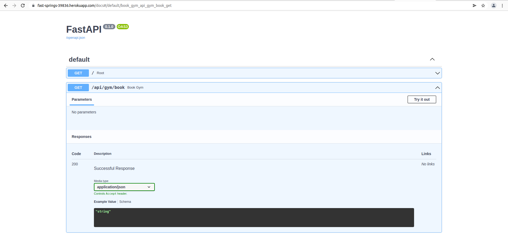
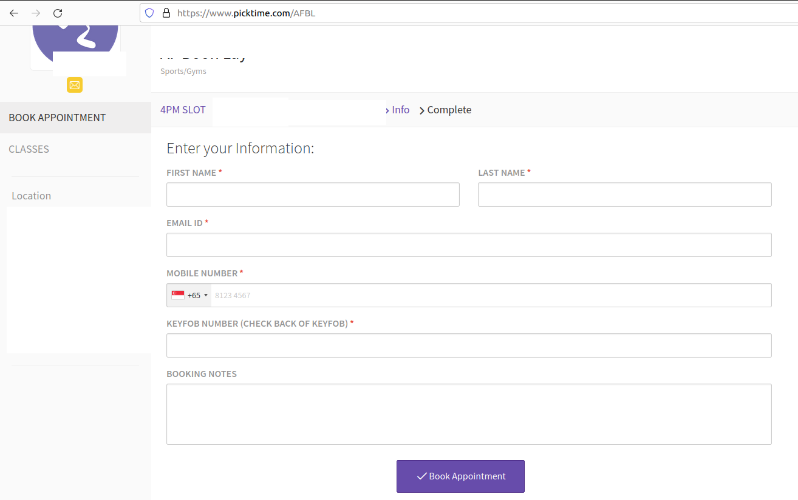
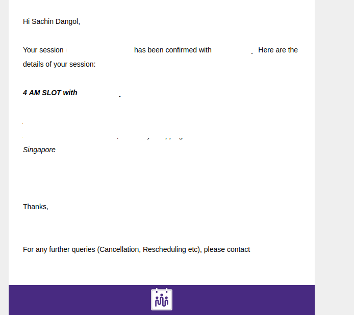

## Book Next Available AF Gym Session
Booking everytime the slot before you go to gym is pain. This program uses `selenium` to automatically book the next hour gym slot. This is purly for personal use.

heroku app: Just visit this website:

[https://fast-springs-39836.herokuapp.com](https://fast-springs-39836.herokuapp.com)

## Installation
The project uses `python3` and `pipenv` hence installation is easy. See documentation: [pipenv](https://pipenv.pypa.io/en/latest/)

## How it works
It exposes only one api built in python FastApi and hosted in Heroku. 
In the mobile just visit the api link then it books the next avaliable slot. Internall api call the selenium and books it.

[AF booking url](https://www.picktime.com/AFBL)

User details are stored as the enviornment variable in `.env` and put in `.gitignore` file. However for heroku it has to be set in the `setting -> config vars`

Booking page requires details like this:

After booking is successful the confirmation mail looks like this:

